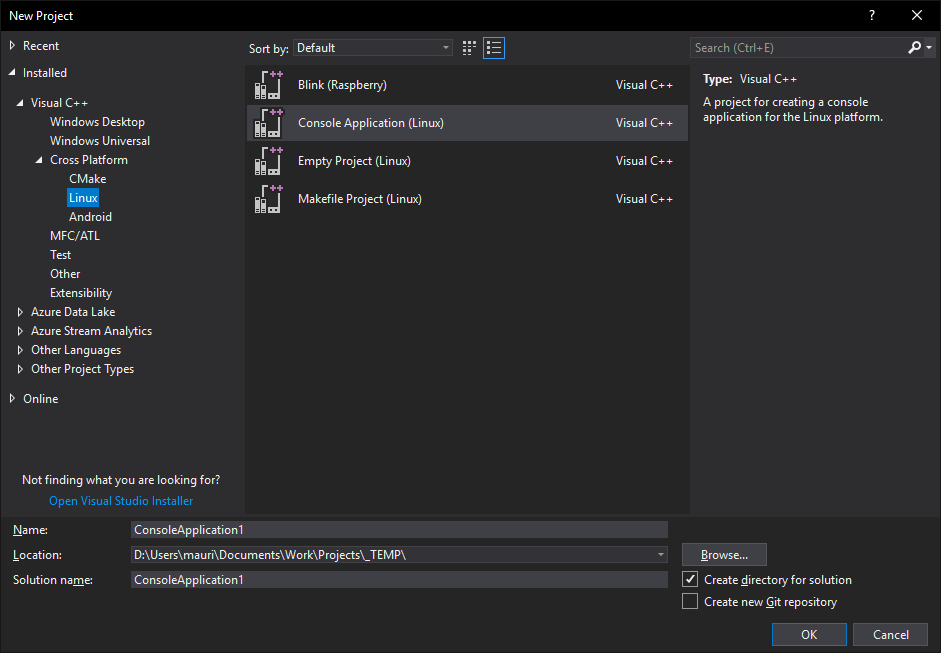
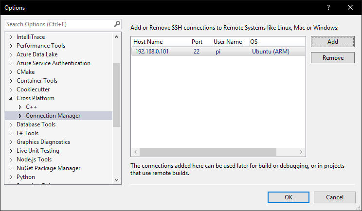
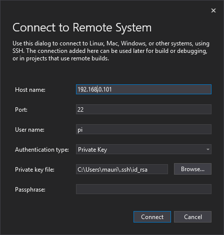

# Set Up C++ ARM Development Toolchain with Visual Studio Code

**`<TLDR></TLDR>`** TThe final goal of this series of notes is to simulate remote debugging of **`Microsoft Visual Studio 2017`** &copy; on a Linux target computer (ie a tiny ARM computer, such as a **`Raspberry Pi`** &copy; or a **`FriendlyARM NanoPi M1 Plus`** &copy;), but using **`Microsoft Visual Studio Code`** &copy;. First of all, let's see what we need to achieve the desired goal. 

## How Visual Studio 2017 does

Following the great **`Scott Hanselman`**'s article [Writing and debugging Linux C++ applications from Visual Studio using the "Windows Subsystem for Linux"](https://www.hanselman.com/blog/WritingAndDebuggingLinuxCApplicationsFromVisualStudioUsingTheWindowsSubsystemForLinux.aspx), let's try to create a *`Cross Platform Linux Console Application`*  project with Visual Studio 2017.

The next step is to configure the IDE to connect *via ssh*, to the remote Linux client. From the *`Tools->Options...`* menu, search for the *`Cross Platform->Connection Manager`* item,

and click on the **`Add`** button

and fill it with the ssh coordinates of the target client