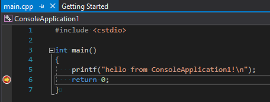
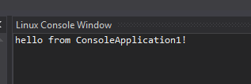
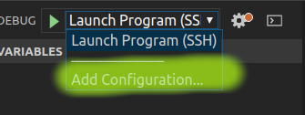
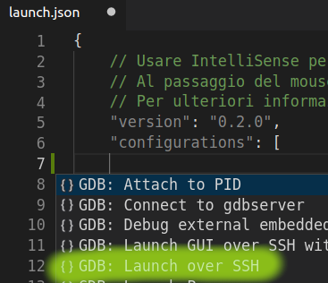

# Set Up C++ ARM Development Toolchain with Visual Studio Code

**`<TLDR></TLDR>`** The final goal this note is to simulate remote debugging of **`Microsoft Visual Studio 2017`** &copy; on a Linux target computer (e.g. a tiny ARM computer, such as a **`Raspberry Pi`** &copy; or a **`FriendlyARM NanoPi M1 Plus`** &copy;), but using **`Microsoft Visual Studio Code`** &copy;.

## Index

- [How Visual Studio 2017 does](#how-visual-studio-2017-does)
    - [Debug mode](#debug-mode)
    - [Release mode](#release-mode)
    - [Let's sum up](#let's-sum-up)
- [Source copy](#sources-copy)
- [Build project](#build-project)
- [Debug](#debug)
- [Demo](#demo)

## How Visual Studio 2017 does

Following the great **`Scott Hanselman`**'s article [Writing and debugging Linux C++ applications from Visual Studio using the "Windows Subsystem for Linux"](https://www.hanselman.com/blog/WritingAndDebuggingLinuxCApplicationsFromVisualStudioUsingTheWindowsSubsystemForLinux.aspx), let's try to create a *`Cross Platform Linux Console Application`*  project with Visual Studio 2017.


The next step is to configure the IDE to connect *via ssh*, to the remote Linux client. From the *`Tools->Options...`* menu, search for the *`Cross Platform->Connection Manager`* item,


and click on the **`Add`** button


and fill it with the ssh coordinates of the target client. Now we're ready, let's build our simple project and see what appens.


### Debug mode

The first time we'll compile our project in *`Debug Mode`*, set a breakpoint in the source file and start a debug session. As shown in the following images the debugger stops correctly at the breakpoint, 



and the output is



### Release mode

For sake of completness, let's compile our project also in *`Release Mode`*

### Let's sum up

Reading the build output shown in Figure 4, the steps taken by the *`full fledged IDE`* are:

1. *Validating sources*;
2. *Copying sources remotely to '192.168.0.101'*;
3. *Validating architecture*;
4. *Starting remote build*;
5. *Compiling sources: main.cpp*;
6. *Start a debug session of the program running on the remote target*;

Omitting the first step, the following are the ones that we will try to reproduce with **`Visual Studio Code`** &copy;

## Sources copy

So the thing VS2017 does is copying all the necessary files to the remote target. Taking a close look to what has been copied, we have:

```
└── projects
    └── ConsoleApplication1
        ├── bin
        │   └── ARM
        │       ├── Debug
        │       │   └── ConsoleApplication1.out
        │       └── Release
        │           └── ConsoleApplication1.out
        ├── main.cpp
        └── obj
            └── ARM
                ├── Debug
                │   └── main.o
                └── Release
                    └── main.o

10 directories, 5 files
pi@NanoPi-M1-Plus:~$
```

We know that for that purpose, the IDE uses the previously configured *`ssh`* connection with the target. For that result we can use the same ssh connection to issue a *`rsync`* command, through a *`VSCode Task`*,

``` json
{
    // See https://go.microsoft.com/fwlink/?LinkId=733558
    // for the documentation about the tasks.json format
    "version": "2.0.0",
    "tasks": [
        {
            "label": "build",
            "type": "shell",
            "command": [
                "rsync -r -a -v -e ssh --delete --exclude '.vscode' $ {workspaceFolder}/ pi@192.168.0.102:/home/pi/projects/console-application/"
                ]
        }
    ]
}
```

## Build project

With the same tecnique above we can also create the necessary folder structure and build our simple project

``` json
{
    // See https://go.microsoft.com/fwlink/?LinkId=733558
    // for the documentation about the tasks.json format
    "version": "2.0.0",
    "tasks": [
        {
            "label": "build",
            "type": "shell",
            "command": [

                ...

                "&&",
                "ssh pi@192.168.0.102",
                "'mkdir /home/pi/projects/console-application/build",
                "&& cd /home/pi/projects/console-application/build",
                "&& cmake .. && make'"
            ]
        }
    ]
}
```

## Debug

Last but not least we need a proper way to debug remotely our application. For that purpose we'll configure a debug session using the VSCode C++ debugger features.



First of all, from the debug launch dropdown menu 



``` json
{
    // Usare IntelliSense per informazioni sui possibili attributi.
    // Al passaggio del mouse vengono visualizzate le descrizioni degli attributi esistenti.
    // Per ulteriori informazioni, visitare: https://go.microsoft.com/fwlink/?linkid=830387
    "version": "0.2.0",
    "configurations": [
        {
            "type": "gdb",
            "request": "launch",
            "name": "Launch Program (SSH)",
            "target": "./build/apps/console-application/console-application",
            "cwd": "${workspaceRoot}",
            "windows": {
                "ssh": {
                    "host": "192.168.1.2",
                    "cwd": "/home/pi/projects/console-application",
                    "keyfile": "C:\\Users\\mauri\\.ssh\\id_rsa",
                    "user": "pi",
                }
            },
            "osx": {
                "ssh": {
                    "host": "192.168.1.2",
                    "cwd": "/home/pi/projects/console-application",
                    "keyfile": "/Users/maurizioattanasi/.ssh/id_rsa",
                    "user": "pi",
                }       
            },
            "linux": {
                "ssh": {
                    "host": "192.168.1.2",
                    "cwd": "/home/pi/projects/console-application",
                    "keyfile": "/Users/maurizioattanasi/.ssh/id_rsa",
                    "user": "pi",
                }       
            },
            "preLaunchTask": "build"
        }
    ]
}
```

## Demo

In the following video, available on my [YouTube Channel](https://www.youtube.com/channel/UCaEsggT05SZOLrAWcMXL7ig?view_as=public), there is a short demo of the *`toolchain`* in action.

[](https://youtu.be/fJe8YJ9XTUg)

Enjoy